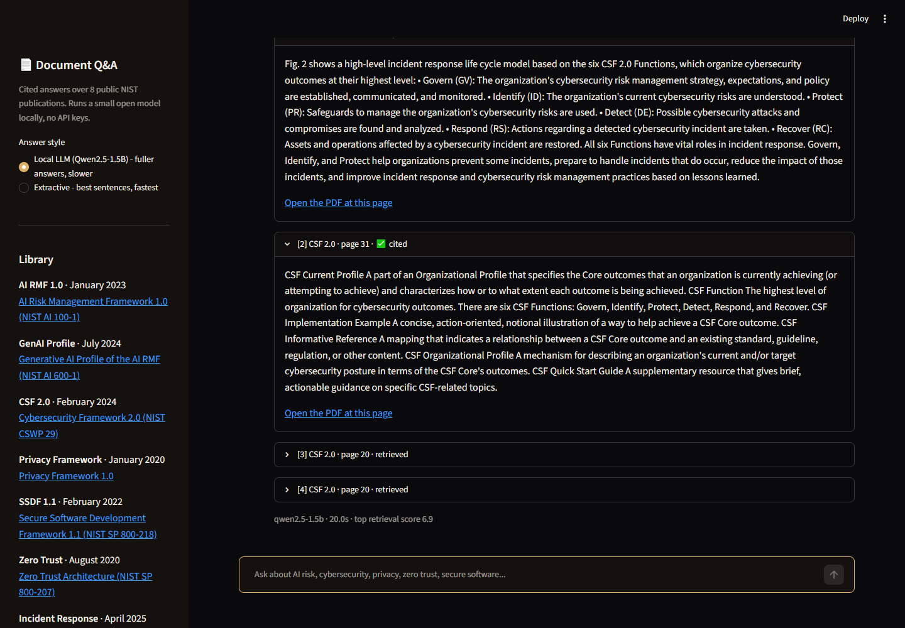
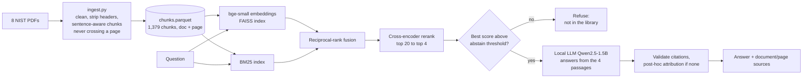
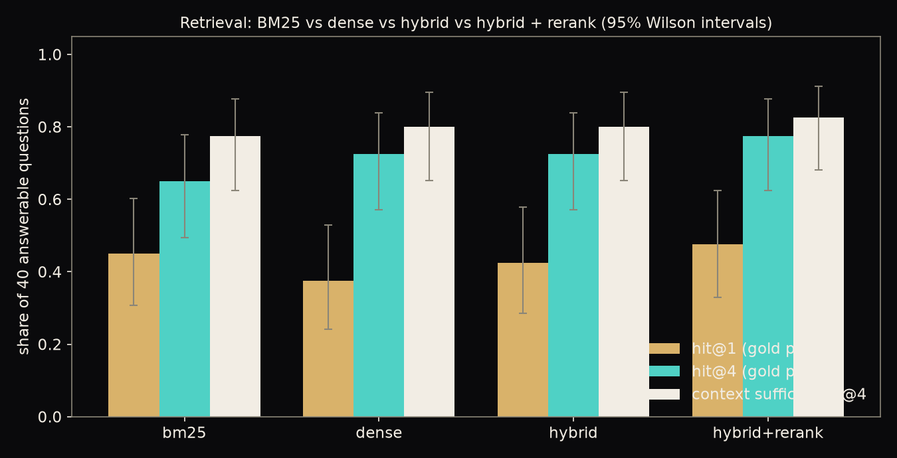
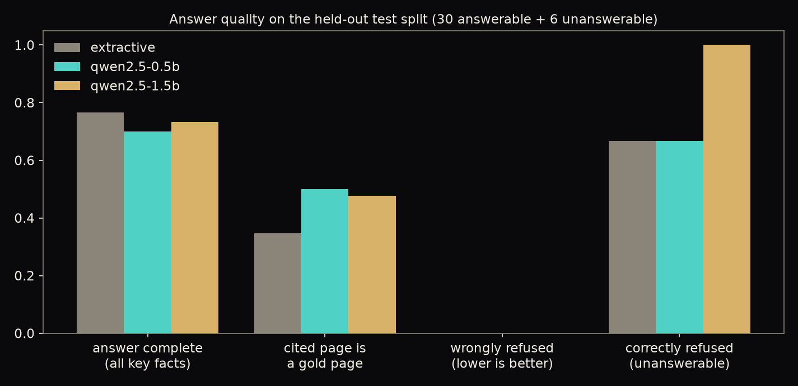
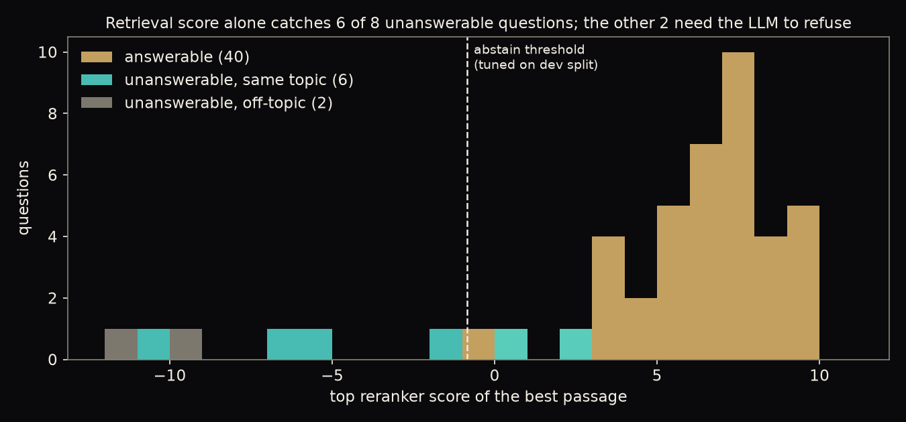
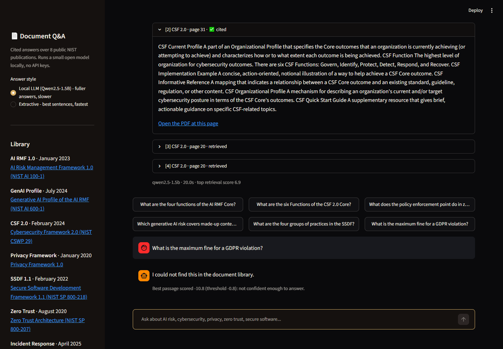

# Document Q&A: A Cited RAG Assistant (GenAI)

Ask a question in plain English and get an answer **with the document and page it came from**, drawn from a library of 8 public NIST publications (AI risk, cybersecurity, privacy, zero trust, secure software, incident response, digital identity). Hybrid retrieval (BM25 + dense embeddings) with a cross-encoder reranker, a small **local** open LLM for the answer, a retrieval-confidence gate that refuses questions the library cannot answer, and a hand-verified evaluation set with honest, small-sample error bars.

**Live demo:** https://document-app-rag-assistant-8xsegsohb7z3zi5ga9pmpc.streamlit.app/ · **Stack:** sentence embeddings (bge-small, ONNX), FAISS, BM25, cross-encoder reranking, llama.cpp (Qwen2.5 GGUF), MLflow, Streamlit



## 1. Business problem

| | |
|---|---|
| **Stakeholder** | A team that has to work from a large set of policy / standards documents (security, compliance, risk, engineering) |
| **Problem** | Finding "what does the standard actually say about X?" by keyword search over hundreds of PDF pages is slow, and a chatbot that answers without sources is unusable for compliance work |
| **Decision it supports** | Get a first answer in seconds, then verify it on the cited page before acting on it |
| **KPIs** | (1) Does retrieval put the answering passage in front of the model? (2) Is the answer complete and correct? (3) Does every answer name its source page? (4) Does it **refuse** when the library does not contain the answer, instead of guessing? |

No paid API and no key to maintain: the embedder, reranker and LLM all run locally, and the models download from the Hugging Face Hub on first use.

## 2. Data: what I chose and why

**8 public U.S. government publications from the National Institute of Standards and Technology** (`nvlpubs.nist.gov`, no login; U.S. federal works, freely reusable), 425 PDF pages:

| Short name | Document | Published | Pages |
|---|---|---|---|
| AI RMF 1.0 | AI Risk Management Framework (NIST AI 100-1) | Jan 2023 | 48 |
| GenAI Profile | Generative AI Profile of the AI RMF (NIST AI 600-1) | Jul 2024 | 64 |
| CSF 2.0 | Cybersecurity Framework 2.0 (NIST CSWP 29) | Feb 2024 | 32 |
| Privacy Framework | NIST Privacy Framework 1.0 | Jan 2020 | 43 |
| SSDF 1.1 | Secure Software Development Framework (SP 800-218) | Feb 2022 | 36 |
| Zero Trust | Zero Trust Architecture (SP 800-207) | Aug 2020 | 59 |
| Incident Response | Incident Response Recommendations (SP 800-61 Rev. 3) | Apr 2025 | 48 |
| Digital Identity | Digital Identity Guidelines (SP 800-63-4) | Jul 2025 | 95 |

Why this set: real, dense, cross-referencing standards behave like a company's internal policy library, every claim can be verified on a page, and the documents overlap enough (the CSF, Privacy Framework and Incident Response guide all describe "Functions") that retrieval has to work rather than get lucky. **A data-quality decision:** I first picked SP 800-61 Rev. 2 and SP 800-63-3, then found NIST has **withdrawn** both; a library that answers from superseded policy is a real RAG failure mode, so I replaced them with the current Rev. 3 and 800-63-4.

The PDFs are not committed (`python -m docqa.download` fetches them). The repo ships the extracted chunk text (`artifacts/chunks.parquet`, needed to show cited passages) and the embeddings; NIST publications are not subject to copyright in the United States, and the app links every page back to the original PDF.

## 3. Architecture



- **Chunking** (`ingest.py`): running headers/footers removed (lines repeated on >35% of a document's pages), ligatures and end-of-line hyphenation repaired, then sentence-aware chunks of ~900 characters with one sentence of overlap. A chunk **never crosses a page**, so every chunk has an exact page citation. 1,379 chunks, median 949 characters.
- **Retrieval** (`retrieve.py`): BM25 and dense (`BAAI/bge-small-en-v1.5`, 384-d, exact FAISS inner product) each pull 30 candidates, merged with reciprocal-rank fusion (no scale tuning), and the top 20 are reranked by a cross-encoder (`ms-marco-MiniLM-L-6-v2`). Embedding and reranking run as ONNX (via `fastembed`), so the deployed app needs no PyTorch.
- **Generation** (`generate.py`): `Qwen2.5-1.5B-Instruct` (Apache-2.0, 4-bit GGUF, ~1 GB) through `llama-cpp-python` on CPU, temperature 0, told to use only the numbered passages and to reply exactly "I could not find this in the document library" otherwise. An extractive baseline (no LLM) is built for comparison.
- **Citations** (`generate.py`, `attribute.py`): `[n]` markers are parsed and any pointing at a passage that was not provided are dropped. **The small models almost never write citations themselves (3% of answers, measured below), so when the model gives none, each answer sentence is attributed to the retrieved passage that best supports it** (cross-encoder score). That tells you where to verify a sentence; it is a support heuristic, not proof of where the model got it, and the app says so when it is used.
- **Refusal** (`rag.py`): if the best passage scores below a threshold the system refuses without calling the LLM. The threshold (-0.84) was tuned **on a 12-question dev split only** (centre of the plateau that separates its answerable from unanswerable questions), never on the test split.

## 4. Evaluation: a hand-verified set, and honest numbers

`eval/qa_set.json`: **40 answerable questions** (4-6 per document) and **8 unanswerable ones**, written by me from the source PDFs (single annotator). Each answerable question has (a) the gold document and page(s), (b) regex evidence that must appear on those pages, and (c) groups of required facts. `eval/build_qa_set.py` **refuses to build the file** unless every question's gold page exists, every required fact is actually present on its gold pages, and each "same-topic unanswerable" question's key terms are absent from the corpus. Unanswerable questions are 2 off-topic (pizza, football) and 6 same-topic-but-not-covered (GDPR fines, PCI DSS password length, vendor "zero trust certifications", HIPAA 1996 audit logging, GPU hardware, consulting prices). 12 questions form a dev split (threshold tuning); the other 36 are the test split. **With 40 questions the error bars are wide** (95% Wilson intervals shown); treat differences of a few points as noise.

### Retrieval (all 40 answerable questions)

Two metrics, because "did we retrieve the right *page*" understates quality when the same fact is repeated on several pages (the CSF's six Functions are listed on pp. 8, 10, 20 and 31 alike):

- **hit@k**: a top-k chunk is on an annotated gold page (strict).
- **suff@k (context sufficiency)**: the top-k chunks *together* contain every required fact, i.e. the LLM is handed enough to answer completely, whichever page it comes from.

| Retriever | hit@1 | hit@4 | hit@10 | MRR@10 | suff@1 | **suff@4** | suff@10 |
|---|---|---|---|---|---|---|---|
| BM25 | 0.45 | 0.65 | 0.85 | 0.56 | 0.55 | 0.78 | 0.85 |
| Dense (bge-small) | 0.38 | 0.72 | 0.88 | 0.54 | 0.53 | 0.80 | 0.90 |
| Hybrid (RRF) | 0.42 | 0.72 | 0.93 | 0.58 | 0.55 | 0.80 | 0.95 |
| **Hybrid + rerank (used)** | **0.47** | **0.78** | 0.90 | **0.63** | **0.65** | **0.82** | 0.90 |



Hybrid + rerank is best on every top-of-list metric, but the gaps between systems are small relative to the intervals (hit@4: 0.78, 95% CI 0.62-0.88). Real finding: **at k=4 (what the LLM sees), only 82% of questions get a context that could yield a complete answer**, so retrieval, not generation, is the ceiling. All 8 top-5 misses are in `artifacts/eval_results.json`; the pattern is ambiguous questions ("How does the profile define the Data Privacy risk?" retrieves the *Privacy Framework*, not the GenAI profile) and definitional questions whose answer sentence sits in a long chunk.

### Answers (held-out test split: 30 answerable + 6 unanswerable)

| System | Answer complete | Mean fact coverage | Cited page is a gold page | Any gold page cited | LLM wrote its own citations | Wrongly refused | Correctly refused | s / answer (8 CPU cores) |
|---|---|---|---|---|---|---|---|---|
| Extractive (no LLM) | **0.77** | 0.79 | 0.35 | 0.73 | n/a (built in) | 0.00 | 0.67 | 1.9 |
| Qwen2.5-0.5B | 0.70 | 0.76 | 0.50 | 0.60 | 0.03 | 0.00 | 0.67 | 9.8 |
| **Qwen2.5-1.5B (used)** | 0.73 | **0.82** | 0.48 | 0.57 | 0.03 | 0.00 | **1.00** | 13.1 |



"Complete" means every required fact group appears in the answer text (a strict substring proxy, not a semantic judge). Complete rate for the 1.5B model is 0.73 (95% CI 0.56-0.86); correct refusals are 6 of 6 (CI 0.61-1.0).

What the numbers actually say, including the uncomfortable parts:

1. **The LLM did not beat the extractive baseline on completeness** (0.73 vs 0.77, well inside the noise). Returning the best retrieved sentences is a genuinely strong baseline; the LLM's value is readable phrasing and **refusal**.
2. **Refusal is where the 1.5B model earns its place.** Retrieval confidence alone catches the off-topic and most same-topic unanswerable questions (below), but two same-topic ones (vendor certifications, GPU hardware) retrieve passages that look relevant (scores 2.8 and 0.5). The 1.5B model refused both; the 0.5B model answered both with confident fabrications ("NIST certifies zero trust compliant products as proprietary, single-vendor controlled APIs"). Extractive cannot refuse them at all.
3. **Small models hallucinate details even with the right passage.** Examples from the 1.5B test answers: it listed "Detect-P" as a Privacy Framework function (there is none), invented an "Identify and Respond to Residual Vulnerabilities (IR)" SSDF group, and described zero trust as "allowing network connectivity to devices and visitors while obscuring enterprise resources". These are why the UI shows the source passage and why the README tells you to verify.
4. **Citation quality is the weakest number.** Only 48% of cited passages are annotated gold pages. Part of that is the strict page metric (a correct passage on a different page is scored wrong; "any gold page cited" is 57%), part is that post-hoc attribution sometimes credits a related-but-not-answering passage. Do not read a citation as a guarantee.



## 5. The app

`app/streamlit_app.py`: a chat interface. Pick a sample question or type your own; the answer streams in, then the **Sources** panel lists each retrieved passage (`document · page`, marked "cited" or "retrieved"), the passage text, and a link that opens the PDF at that page. Off-library questions get "I could not find this in the document library" plus the retrieval score that triggered it. A sidebar switch lets you use the fast extractive mode. The limitations are in the sidebar, not buried.

| Refusal | Sources with page links |
|---|---|
|  |  |

## 6. Limitations (please read)

- **Hallucination risk is real** for a 1.5B model (section 4, point 3). It is mitigated by grounding, refusal and visible sources, not eliminated. This is a retrieval-and-verify tool, not an oracle.
- **Context limit:** only the top 4 passages (~4,000 characters) reach the model, so questions that need many pages, a comparison across documents, or a whole-document summary will be incomplete. 18% of evaluation questions did not even have a sufficient context.
- **Evaluation is small and single-annotator** (40 + 8 questions). The refusal threshold was tuned on only 2 unanswerable dev questions, so it is a sane default, not an optimised value.
- **Tables and figures** in the PDFs are extracted as plain text and can be garbled; questions answered only by a table or diagram are weak spots.
- **Latency:** 10-20 s per answer on a CPU laptop; the first answer after a cold start also downloads ~1 GB of model files.
- **Scope:** English, 8 documents. It will refuse legitimate questions about anything outside them.

## 7. Run it

```bash
uv sync --all-groups --extra llm       # --extra llm installs llama-cpp-python (CPU wheel index)
uv run python -m docqa.ingest           # download the PDFs, build chunks.parquet
uv run python -m docqa.retrieve         # embed the chunks (a few minutes on CPU)
uv run python eval/build_qa_set.py      # rebuild + validate the evaluation set
uv run python -m docqa.run_eval retrieval
uv run python -m docqa.run_eval generation      # runs the LLMs over all 48 questions (~25 min)
uv run streamlit run app/streamlit_app.py
uv run pytest -q && uv run ruff check .
```

Experiments are tracked with MLflow (`mlflow.db`, experiment `docqa`): one run per retriever and per answering system, with parameters and metrics.

```
src/docqa/     config, download, ingest (chunking), retrieve (BM25/dense/RRF/rerank), generate, attribute, rag, evaluate, run_eval, report
eval/          the hand-written question set + the script that validates it
app/           Streamlit chat UI
artifacts/     chunks.parquet, embeddings.npy, eval_results.json (all per-question answers)
tests/         19 offline tests (fake embedder, no PDFs, models or network)
```

**Deploy:** Streamlit Community Cloud (main file `app/streamlit_app.py`, `requirements.txt` already points pip at the CPU wheel index for `llama-cpp-python`) or the included `Dockerfile`.

CI (`.github/workflows/ci.yml`) runs ruff and the offline tests on every push.

## Attribution and license

Code: MIT (see `LICENSE`). Source documents: NIST publications (U.S. Government works, not subject to copyright in the United States); please cite NIST as the source. Models: BAAI bge-small-en-v1.5 (MIT), Xenova/ms-marco-MiniLM-L-6-v2 (Apache-2.0), Qwen2.5-Instruct (Apache-2.0).
